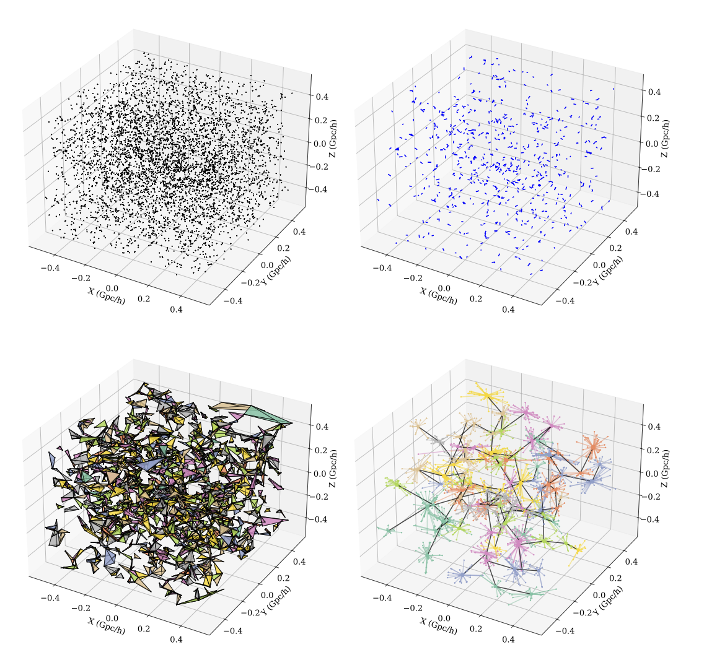
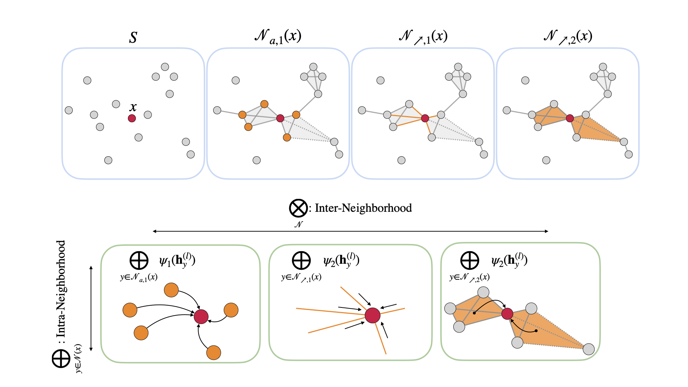

# TopoGal
<p align="center">
  
</p>
Combinatorial Complex built on a Halo Catalog from the Quijote Suite. 

## Requirements
Refer to [`environments.yml`](./environments.yml) for the full list of required Python packages.

Key dependencies are based on the [TopoModelX repository](https://github.com/pyt-team/TopoModelX) and include:

- `torch-sparse`
- `torch-scatter`
- `torch-cluster`
- `optuna`
- `optuna-integration`

## Configuration and Instructions

### Step 1: Machine/Data Configuration
To run the code, first configure the machine and data type. These settings are easily extendable to accommodate different use cases.

The `machine.py` file serves as the master configuration, governing the entire pipeline from preprocessing to training and testing.  
Important configuration options include:

- `MACHINE`, `TYPE`, `SUBGRID`: define the machine setup and data variant.
- `BASE_DIR`, `DATA_DIR`, `RESULT_DIR`: set paths for base, data, and output directories.
- `LABEL_FILES`, `CATALOG_SIZE`: specify label sources and dataset size.

Next, modify `config_param.py` to set up priors for the cosmological and astrophysical parameters of the simulations. 

### Step 2: Preprocessing
All preprocessing-related files are located in the `/preprocessing` directory. Run `generate_cc.py` to construct combinatorial complexes.

The complex includes:

- Rank 0 (Nodes): Individual galaxies/halos  
- Rank 1 (Edges): Connections using linking distance `r_link`  
- Rank 2 (Tetrahedra): Created via Delaunay triangulation  
- Rank 3 (Clusters): Groups of tetrahedra  
- Rank 4 (Hyperedges): Minimum spanning tree (MST) of clusters  

Adjust preprocessing settings such as `r_link` and the cutoff for higher-order cells in `config_preprocess.py`.

### Step 3: Training
The training setup supports PyTorch DDP (DistributedDataParallel), multi-node GPU execution, and is designed to be scalable.
If you're using a SLURM-based queue system, submit training jobs with:

```bash
sbatch run.slurm
```

There are two main training options:

#### 1. Manual Hyperparameter Choice
- Set hyperparameters via `config/config.py`
- Run `main.py`

#### 2. Hyperparameter Sweep with Optuna
- Set hyperparameter ranges in `config/hyperparameters.py`
- Run `tune.py`

## E(3)-Invariant Higher-Order Networks
Our models are invariant under E(3) transformations. We support four model variants:

- **GNN**
- **TetraTNN**
- **ClusterTNN**
- **TNN**

These models differ based on the selection of cells (e.g., nodes, edges, tetrahedra, clusters). They are stackable, and the number of stacked layers is treated as a tunable hyperparameter. Cell-cell invariant features (e.g., Euclidean or Hausdorff distances between arbitrary-rank cells) can be incorporated into the computations.

All computations are implemented using `SparseTensor` operations for efficiency and scalability. Image below briefly demonstrates how higher-order message-passings are conducted.

<p align="center">
  
</p>

## Acknowledgements
We acknowledge the use of [TopoModelX](https://github.com/pyt-team/TopoModelX) and [TopoNetX](https://github.com/pyt-team/TopoNetX) for our higher-order network models and creation of combinatorial complexes. We also acknowledge the use and modification of [CosmoGraphNet](https://github.com/PabloVD/CosmoGraphNet) for building graphs. 
